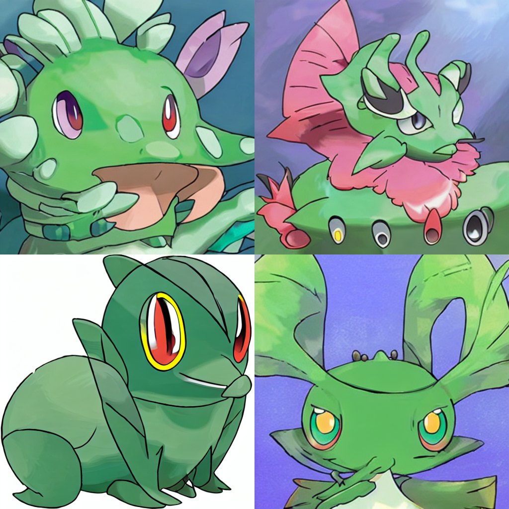
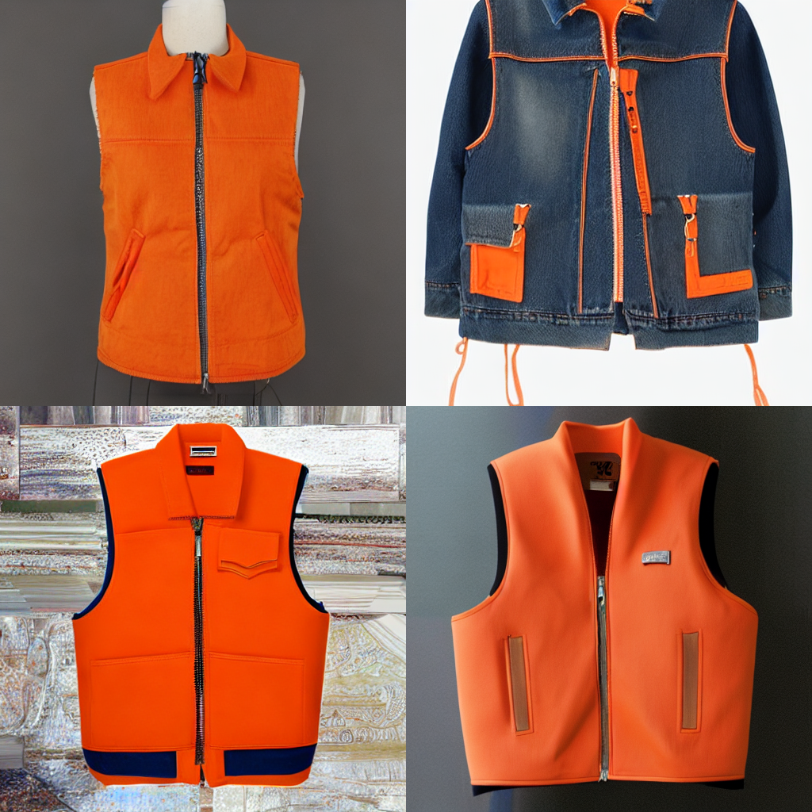

# Stable Diffusion Training Results

Training script:

- Hugging Face Diffusers > Training > [Low-Rank Adaptation of Large Language Models (LoRA)](https://huggingface.co/docs/diffusers/training/lora#lowrank-adaptation-of-large-language-models-lora)

Base models:

- [runwayml/stable-diffusion-v1-5](https://huggingface.co/runwayml/stable-diffusion-v1-5)
- [CompVis/stable-diffusion-v1-1](https://huggingface.co/CompVis/stable-diffusion-v1-1)

Datasets:

- [lambdalabs/pokemon-blip-captions](https://huggingface.co/datasets/lambdalabs/pokemon-blip-captions): Images of Pokémon characters
- [zoheb/sketch-scene](https://huggingface.co/datasets/zoheb/sketch-scene): Freehand scene sketches that convey well scene content but can be sketched within a few minutes by a person with any sketching skills.
- [hahminlew/kream-product-blip-captions](https://huggingface.co/datasets/hahminlew/kream-product-blip-captions): Clothing images from KREAM, a popular online clothing resell market based in Korea.

## Stable Diffusion 1.1

### Dataset: Pokémon

- W&B Training Instance: [sd-1-1-pokemon-lora](https://wandb.ai/jordanalihilado/text2image-fine-tune/runs/knm903a5/overview?workspace=user-jordanalihilado)
- Hugging Face Model: [jordanhilado/sd-1-1-pokemon-lora](https://huggingface.co/jordanhilado/sd-1-1-pokemon-lora)

| Prompt                                                                | Pre-trained                                                                                   | Fine-tuned                                                                                    |
| --------------------------------------------------------------------- | --------------------------------------------------------------------------------------------- | --------------------------------------------------------------------------------------------- |
| "A pokemon red and white cartoon ball with an angry look on its face" |  |  |
| "A blue dragon pokemon flying through the air"                        |  |  |
| "A green pokemon fish with big eyes"                                  |  |  |

### Dataset: Sketch Scene

- W&B Training Instance: [sd-1-1-sketch-lora](https://wandb.ai/jordanalihilado/text2image-fine-tune/runs/37nuy63x/overview?workspace=user-jordanalihilado)
- Hugging Face Model: [jordanhilado/sd-1-1-sketch-lora](https://huggingface.co/jordanhilado/sd-1-1-sketch-lora)

| Prompt                                                  | Pre-trained                                                                                 | Fine-tuned                                                                                  |
| ------------------------------------------------------- | ------------------------------------------------------------------------------------------- | ------------------------------------------------------------------------------------------- |
| "A sketch of a scene with a tree and a house"           |  |  |
| "A sketch of a scene of two walking zebras in a jungle" |  |  |
| "A sketch of a scene of an airplane flying in the air"  |  |  |

### Dataset: KREAM

- W&B Training Instance: [sd-1-1-kream-lora](https://wandb.ai/jordanalihilado/text2image-fine-tune/runs/0i86earc/overview?workspace=user-jordanalihilado)
- Hugging Face Model: [jordanhilado/sd-1-1-kream-lora](https://huggingface.co/jordanhilado/sd-1-1-kream-lora)

| Prompt                                                             | Pre-trained                                                                               | Fine-tuned                                                                                |
| ------------------------------------------------------------------ | ----------------------------------------------------------------------------------------- | ----------------------------------------------------------------------------------------- |
| "A black nike jacket with a hoodie and zipper"                     |  |  |
| "Green Arc'teryx jacket with a hood and a white logo on the front" |  |  |
| "A Levi's orange vest with a zipper and collar"                    |  |  |
